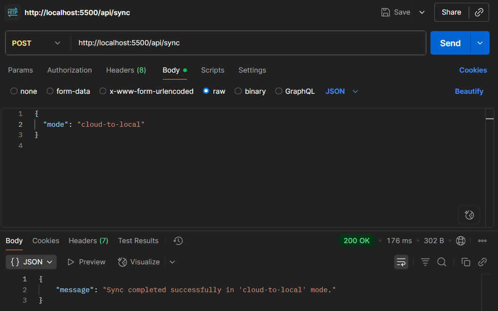
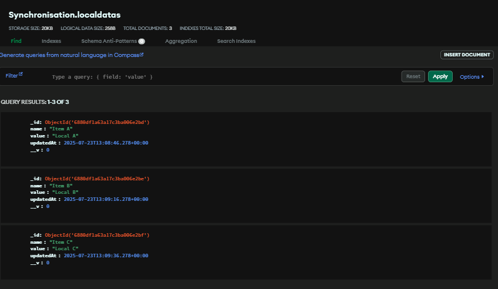
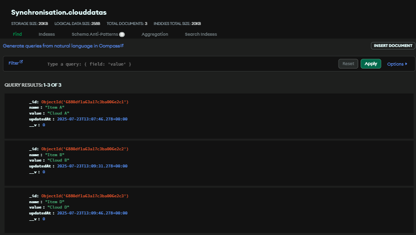
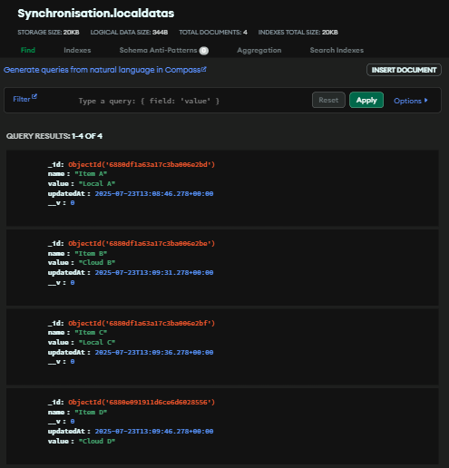
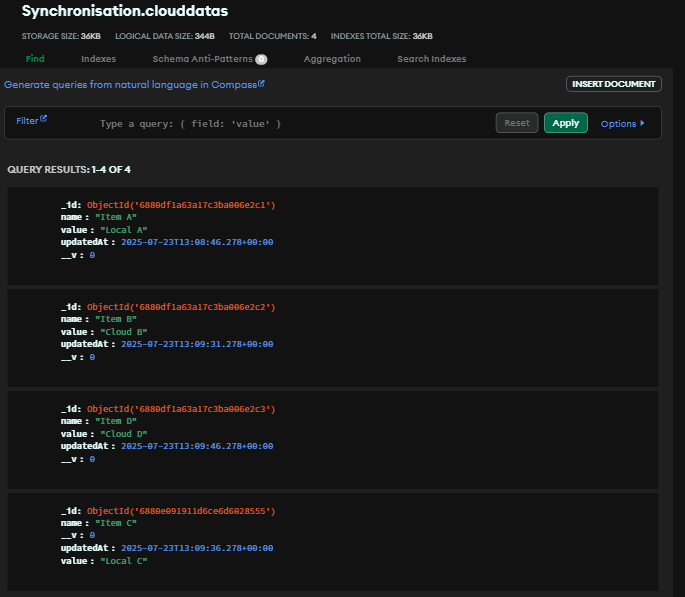

# Near Real-Time/Configurable Data Synchronization System

## 📚 Table of Contents

- [📌 Overview](#-overview)
- [🎯 Purpose](#-purpose)
- [⚙️ Tech Stack](#️-tech-stack)
- [🔄 Features](#-features)
- [🧩 Project Structure](#-project-structure)
- [🚀 Getting Started](#-getting-started)
  - [1️⃣ Clone the repository](#1-clone-the-repository)
  - [2️⃣ Install dependencies](#2-install-dependencies)
  - [3️⃣ Setup environment variables](#3-setup-environment-variables)
  - [4️⃣ Run the app](#4-run-the-app)
- [📂 API Endpoints](#-api-endpoints)
- [🖼️ MongoDB Atlas Sync Demo (Before vs After)](#️-mongodb-atlas-sync-demo-before-vs-after)
- [🙋‍♂️ Author](#️-author)

## 📌 Overview

This project simulates a **data synchronization system** between a local client database and a cloud server database. Although both are implemented as MongoDB collections in the same database for simplicity, this setup mimics real-world systems where distributed client machines need to sync their local data with a central server efficiently and reliably.

The sync engine ensures that:
- Only the modified data is transferred (differential sync)
- Data is synchronized **both ways** (local ↔ cloud)
- Conflicts are resolved smartly
- Sync can be triggered manually or automatically on a schedule

---

## 🎯 Purpose

In large-scale, distributed, or **offline-first** applications, each client may operate independently and store data locally due to:
- Limited or no internet access
- Latency concerns
- Data privacy or performance

Over time, syncing this data to a central **cloud database** becomes necessary for:
- Analytics and monitoring
- Centralized backups
- Inter-client consistency
- Business intelligence

This project demonstrates how such synchronization can be implemented and made configurable.

---

## ⚙️ Tech Stack

- **Backend**: Node.js, Express.js
- **Database**: MongoDB (via Mongoose)
- **Scheduler**: node-cron (for auto-sync intervals)
- **Environment Config**: dotenv

---

## 🔄 Features

- 🔁 **Two-way synchronization** between `local_data` and `cloud_data`
- ⚙️ **Sync Modes Supported**:
  - `both-ways`: default — syncs data in both directions
  - `local-to-cloud`: sync only from local → cloud
  - `cloud-to-local`: sync only from cloud → local
  - `overwrite-local`: overwrite local data with cloud data
- 🧠 **Conflict Resolution**:
  - When a document is updated on both sides, the one with the **latest `updatedAt` timestamp** is preserved
- 🔘 **Manual Sync API**:
  - `POST /api/sync` — trigger sync on demand
- ⏱️ **Automatic Sync with Cron**:
  - Uses `node-cron` to schedule syncs at configurable intervals
  - Cron expression is set via `.env` file (e.g., `*/5 * * * *` for every 5 minutes)
- 🧪 **Sample Schema**:
  ```js
  {
    name: String,
    value: String,
    updatedAt: Date
  }

## 🧩 Project Structure
```
data-sync-system/
│
├── models/
│   ├── cloudData.model.js
│   └── localData.model.js
│
├── routes/
│   └── sync.route.js
│
├── controllers/
│   └── sync.controller.js
│
├── utils/
│   └── syncEngine.js          # Core logic for syncing and conflict resolution
│
├── config/
│   └── db.js                  # MongoDB connection logic
│
├── seed/
│   └── seed.js                # Seed dummy data for testing
│
├── .env.example               # Sample environment configuration
├── package.json
├── app.js
└── README.md
```

## 🚀 Getting Started

# 1. Clone the repository
  
```bash
git clone https://github.com/Yash531548/Audio-Transcription-Api.git
cd Audio-Transcription-Api
```
# 2. Install dependencies
```bash
npm install
```

# 3. Setup environment variables

Create a `.env` file using `.env.example`:
```env
PORT=5500
NODE_ENV='development'

# MongoDB
DB_URI=mongodb+srv://<username>:<password>@cluster0.xnt8uyl.mongodb.net/?retryWrites=true&w=majority&appName=Cluster0

```
# 4. Run the app
```bash 
npm run dev
```
## 📂 API Endpoints

### 🧾 Trigger Sync

**POST** `/api/sync`
Triggers the synchronization process based on the configured mode.

**Request Body:**Example

```json
{
  "mode" : "cloud-to-local",
}
```


## 🖼️ MongoDB Atlas Sync Demo (Before vs After)

Here’s a quick visual of how synchronization works between `local_data` and `cloud_data`:

### 🔹 Before Sync:

| Local Collection | Cloud Collection |
|------------------|------------------|
|  |  |

### 🔄 After Sync:

| Local Collection | Cloud Collection |
|------------------|------------------|
|  |  |

> ☁️ As shown above, the data was updated and synced correctly based on the chosen sync mode (`both-ways`,`cloud-to-local` etc.).


### 🙋‍♂️ Author
Made with ❤️ by Yash Sharma
